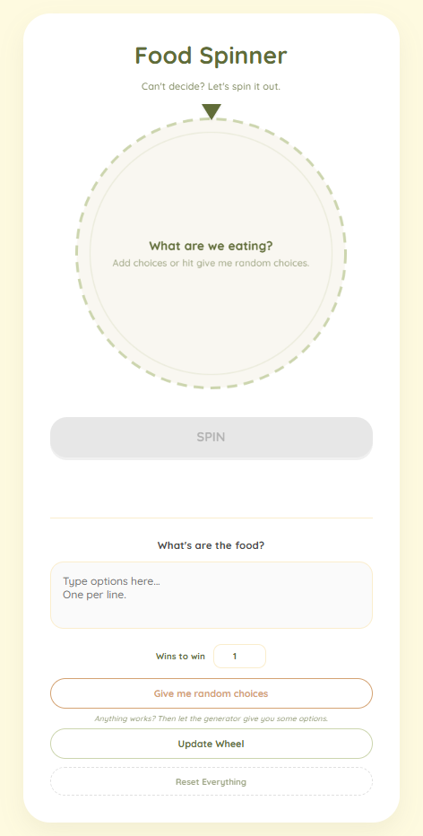

# Food Spinner

## What this is

Deciding what to eat is a pain without the *s* sometimes.

So I built this little spinner to make the decision for my friend and I.  
Instead of going back and forth for 30 minutes, we just spin the wheel and go with whatever it picks.

Simple solution to a small problemo.

## How to use

1. Add food options (one per line) or hit **Give me random choices**.
2. Set how many votes are needed to win, or leave it at 1 for a single spin.
3. Press **Spin**.
4. Go eat whatever the wheel decides (or not).

## Features

**Custom options**  
Type whatever food options you want. One per line.

**Random food generator**  
If you have no ideas, hit **Give me random choices** and it fills the list with random foods.

**First-to-X votes mode**  
You can do a single spin or set a target number of wins.  
Each spin counts as one vote, and the first option to reach the target wins.

**Scoreboard**  
Tracks votes as the wheel spins.

**Click to copy**  
Click the final result to copy it to your clipboard.

## Preview

## License

MIT License
